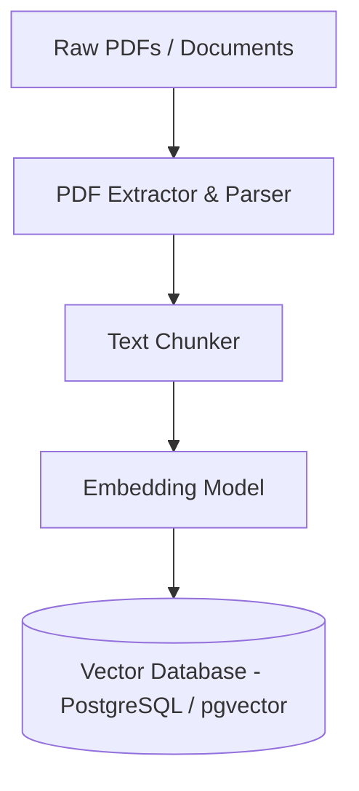
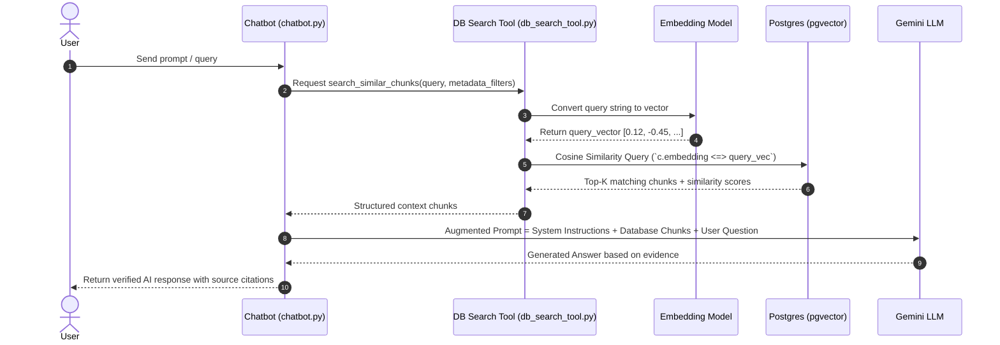

# RAG & Embedding Architecture Guide

This document explains **Retrieval-Augmented Generation (RAG)**, how documents are converted into numerical vector embeddings for database storage, and how context is retrieved during every AI chat invocation.

---

## 1. What is RAG (Retrieval-Augmented Generation)?

Large Language Models (LLMs) have vast static knowledge but cannot access your private, up-to-date, or domain-specific files directly. **RAG** bridges this gap by combining:
1. **Retrieval**: Fetching relevant text chunks from a database based on semantic similarity to the user's query.
2. **Augmentation**: Injecting those retrieved chunks directly into the prompt given to the LLM.
3. **Generation**: Having the LLM answer using *only* the retrieved, verified background facts.

---

## 2. Ingestion Pipeline: How Data is Stored as Embeddings

Before any chat occurs, raw documents (e.g., PDF court reports or case files) must be ingested and converted into vector embeddings.



### Step 1: Extraction & Metadata Parsing
- Raw PDF files are read and split into structured content alongside metadata (such as `file_name`, `entity_name`, `page_number`, `father_name`, `state`).
- In this workspace, this is handled by [ingest_documents.py](file:///d:/automate-case/ingest_documents.py).

### Step 2: Text Chunking
- Long documents cannot fit into single embedding windows effectively, nor can a whole document pinpoint exact answers.
- The text is split into smaller, overlapping passages called **chunks** (e.g., 500–1000 characters with 100-character overlap).

### Step 3: Embedding Generation
- Each text chunk is passed through an **Embedding Model** (e.g., `text-embedding-004` or HuggingFace sentence-transformers).
- The model translates the text snippet into a high-dimensional vector (an array of floating-point numbers like `[0.023, -0.412, 0.891, ...]`).
- **Why?** Similar semantic meanings land close to each other in this multi-dimensional vector space, regardless of specific keywords used.

### Step 4: Storing in Database (`pgvector` / SQLite)
- The raw chunk text, document ID, page number, and its **vector embedding** are saved into the `document_chunks` table:
```sql
CREATE TABLE document_chunks (
    id SERIAL PRIMARY KEY,
    document_id INT REFERENCES documents(id),
    page_number INT,
    chunk_text TEXT,
    metadata JSONB,
    embedding vector(768)  -- Stores the 768-dimensional vector
);
```

---

## 3. Query & Retrieval Pipeline: On Every AI Chat Invocation

When a user submits a chat message (e.g., *"Find cases involving John Doe in Karnataka"*), the system executes the following real-time workflow:



### Detailed Breakdown of Every Chat Invoke:

1. **User Request Received**
   - The user enters a question in the UI or CLI handled by [chatbot.py](file:///d:/automate-case/chatbot.py).

2. **Query Vectorization**
   - The user's input text is sent to the embedding model to generate a **query vector** of the exact same dimension (e.g. 768 float values).

3. **Vector Distance Search (Database Query)**
   - The system queries PostgreSQL using `pgvector`'s distance operator (`<=>` for Cosine Distance or `<->` for L2 Distance):
   ```sql
   SELECT 
       c.chunk_text, d.file_name, c.page_number,
       (c.embedding <=> %s::vector) AS cosine_distance
   FROM document_chunks c
   JOIN documents d ON c.document_id = d.id
   WHERE c.metadata->>'state' ILIKE '%Karnataka%'  -- Hybrid Metadata Filter
   ORDER BY c.embedding <=> %s::vector ASC
   LIMIT 5;
   ```
   - In [db_search_tool.py](file:///d:/automate-case/db_search_tool.py), this retrieves the top `K` most relevant chunks with similarity scores.

4. **Prompt Augmentation**
   - The chatbot formats the top matching database chunks into a clear text context block:
   ```text
   SYSTEM PROMPT: You are a legal assistant. Answer using ONLY the provided facts.
   
   CONTEXT FROM DATABASE:
   [Source 1: report_10.pdf, Page 3]
   "Respondent: John Doe, S/O Richard Doe, State: Karnataka..."
   
   USER QUESTION:
   "Find cases involving John Doe in Karnataka"
   ```

5. **LLM Generation & Output**
   - The augmented prompt is sent to Gemini/LLM.
   - The model synthesizes the context and returns an accurate answer backed by real database records without hallucinating.

---

## 4. Key Files in Workspace

- [ingest_documents.py](file:///d:/automate-case/ingest_documents.py): Handles document parsing, text chunking, embedding generation, and DB insertion.
- [db_search_tool.py](file:///d:/automate-case/db_search_tool.py): Implements vector cosine similarity search and metadata filtering.
- [chatbot.py](file:///d:/automate-case/chatbot.py): Coordinates user chat invocations, database retrieval, prompt construction, and Gemini LLM responses.
